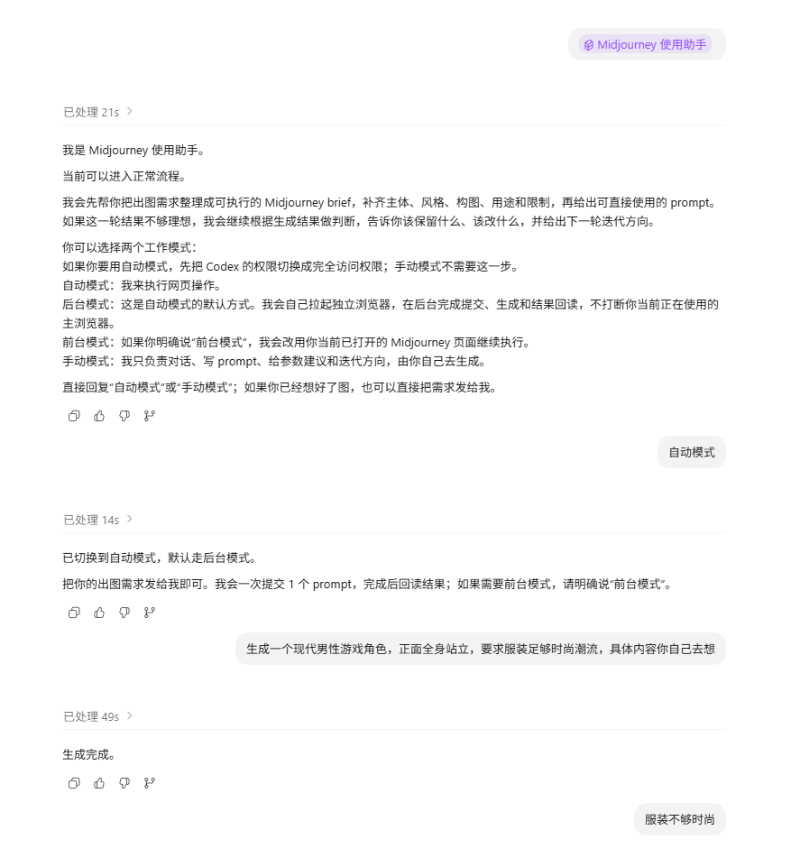

# codex-midjourney-assistant

`midjourney-assistant` 是一个给 Codex 使用的 Midjourney 专业助手 skill。

它不只是代点网页，还会把用户需求整理成可执行的 Midjourney `brief`、`solution_plan` 和英文 `prompt`，并在自动模式或手动模式下持续做结果判断与迭代。

## 当前能力

- 自动模式
  - 默认走后台模式，自动拉起独立浏览器完成 Midjourney 登录态检查、提交、结果回读和多轮继续生成
  - 保留前台模式，兼容直接操作当前已打开的 Midjourney 页面
- 手动模式
  - 只负责对话、需求整理、英文 prompt、参数建议、结果判断和下一轮迭代建议
- 知识主链
  - 先做任务分型、解法选择、prompt 规划，再进入自动或手动执行
- 长期记录
  - 支持用户画像、项目上下文、经验沉淀和模板候选

## 运行效果

下面是一次自动模式下的连续生图和反馈迭代过程：先启动助手并切换自动模式，再提交角色需求，随后根据生成结果逐轮调整服装、配色、发型和画风。

<p align="center">
  
</p>

<p align="center">
  
</p>

<p align="center">
  
</p>

## 仓库结构

```text
docs/
  images/              README 展示截图
midjourney-assistant/
  SKILL.md
  agents/
  assets/
  references/
  scripts/
```

仓库只包含 skill 本体，不包含任何本地记忆、运行日志、登录态或个人环境状态。

## 快速安装

如果目标机器已经装好了 Codex，可以直接安装：

```powershell
python "$env:USERPROFILE\.codex\skills\.system\skill-installer\scripts\install-skill-from-github.py" `
  --repo ningda-li/codex-midjourney-assistant `
  --path midjourney-assistant `
  --ref main
```

安装完成后，重启 Codex。

## 运行前提

当前自动模式要求：

- Windows 桌面环境
- 可用的 PowerShell
- Node.js
- 至少一个受支持的 Chromium 浏览器
  - Edge
  - Chrome
  - Brave
  - Vivaldi
  - Arc

如果自动模式首次测试时一台电脑上没有检测到任何可用浏览器，skill 会直接建议先安装 Edge。

## 安装

更多安装方法、首次启动说明和发布建议见 [INSTALL.md](./INSTALL.md)。
